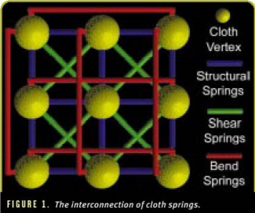
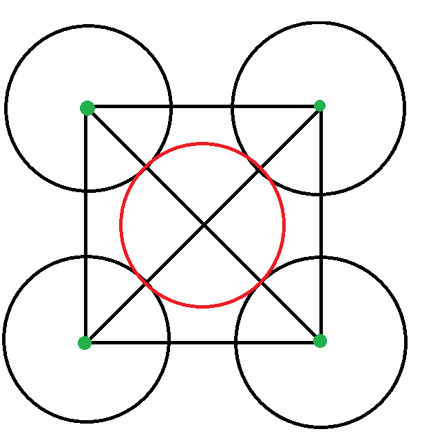
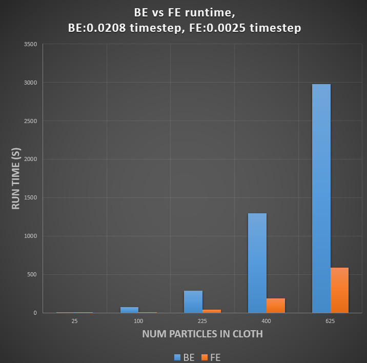
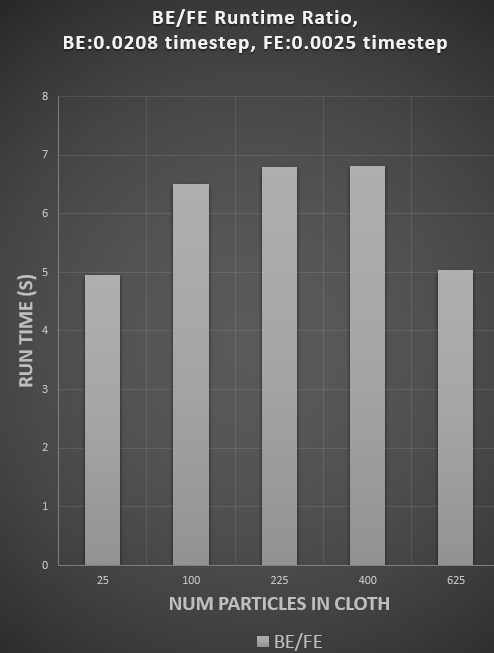

# Resources
* Lecture materials 
* https://graphics.stanford.edu/~mdfisher/cloth.html 

# Project Link
* https://github.com/loshjawrence/ClothSim 

# Files
* videos and .gif's in top level folder(*.gif, JoshLawrence_AllBasicTests*.mp4)
* README.pdf of this README.md also in top level folder

# Cloth simulation features 
* Cloth<->object(ball and ground), cloth<->other cloth, and cloth<->self intersection
* Can constrain points on the cloth and can also have those points oscillate with trig function.
* Stretch and compress limits to get the cloth to behave more realistically (not like rubber)
* Bend springs to keep the cloth locally flat to achieve realistic looking folds
* Shear spring so the cloth doesn't collapse or stretch too much diagonally
* Forward and Backward Euler integration methods.
* simulation run in c++, frames printed out in .poly file format so they can fed into houdini for visualization

# Cloth Setup
* NxM grid of vertices. 
* Structural springs exist between all adjacent neighbors (up, down, left, right, diagonals).
* Structural springs ensure the cloth exhibits cloth like behavior along the longitude, latitude, and shear directions.
* Bend springs exist between between every other vertex on up, down, left, right direction. 
* Bend springs ensure the cloth is locally flat by activating during compression by pushing away adjacent quad faces of the cloth.
* Stretch and compression limits are set on the cloth at an amount of 10% 
* This is done to make the cloth behave more like yarn material rather than a rubber material.

# Notes on collisions
* For collision, the cloth particles are represented as spheres. 
* Sphere radius set for worst case scenario: a sphere falling through the center of a cloth square when all springs in the square are stretched to their limit.
* Collision is then checking every sphere against every other sphere (for both self collision and other cloth collision).
* If within range, the particles are pushed apart so they are no longer touching.
* Velocity adjusted by subtracting off the component perpendicular to the plane of collision.
* This is similar to Granm-Schmidt orthogonalization

* Green points are 4 adjacent vertices in cloth (a cloth square), lines connecting them are their structural and shear springs, the black spheres are their collision bounds
* Red sphere is a collision bound of the same cloth or a different cloth. 
* Sphere radius set for worst case scenario: a sphere falling through the center of a cloth square when all springs in the square are stretched to their limit.

**Backward Euler Sim (30x30 cloth)** 

**Backward Euler Sim** 

**Forward Euler Sim** 

**Backward Euler Sim (30x30 cloth)** 

# Thoughts on FE vs BE
* FE is still much faster even when taking many more steps than BE.
* BE code is more complex than FE.
* BE must begin to include capsule capsule collision tests at larger time steps.
* BE must do more complex collision testing and adjustments when taking large time steps. For example must begin to include capsule-capsule collision tests are larger time steps. 
**Graphs** 

# Future improvements
* Currently, collision is O(n^2). For high res cloth, it might be worth constructing a kd-tree and doing k-nearest neighbor search instead. This would amount to O(nlogn + logn).
* Another option is to have a regular grid centered relative to the center vertex in the cloth, spanning the max stretch length, rotated for max extent in x, y and z. Grid size determined by radius of cloth vertex. Then check the 27 grid cells surrounding the cell that the vertex falls into and form a list of vertices to check for collision. This would be O(n + n). For cloth <--> other cloth collisions you just need to know the relative offset of cloth centers to determine where a vertex of one cloth falls within the grid of another then proceed as normal.
* Like the mdfisher resource mentioned at the top suggests, simulating at high res is costly but you can approximate high res by simulating at low res then perform mesh subdivision and vertex smoothing. 

